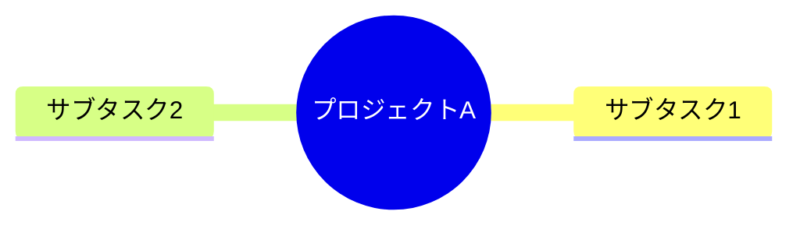

# xmind_to_markdown

## XMind変換ツール集

このプロジェクトは、XMindファイルをMarkdown形式およびMermaid記法形式に変換するスクリプト群を提供します。

### ファイル構成

```
project/
│
├── xmind2both.py         # XMindファイルをMarkdownとMermaid記法の両方に変換
├── xmind2markdown.py     # XMindファイルをMarkdown形式に変換
├── xmind2mermaid.py      # XMindファイルをMermaid記法形式に変換
├── input/                # XMindファイルを配置するディレクトリ
└── output/               # 変換結果を保存するディレクトリ
    ├── markdown/         # Markdown形式の出力
    └── mermaid/          # Mermaid記法形式の出力
```

---

### スクリプトの説明

#### 1. `xmind2both.py`

- **機能**: 
  - XMindファイルをMarkdown形式（Markmap用）とMermaid記法形式の両方に変換。
  - `output/markdown`と`output/mermaid`ディレクトリに出力します。
  - 変換後、`input`ディレクトリのXMindファイルは削除されます。

#### 2. `xmind2markdown.py`

- **機能**: 
  - XMindファイルをMarkdown形式（Markmap用）に変換。
  - `output/markdown`ディレクトリに出力します。
  - 変換後、`input`ディレクトリのXMindファイルは削除されます。

#### 3. `xmind2mermaid.py`

- **機能**: 
  - XMindファイルをMermaid記法形式に変換。
  - `output/mermaid`ディレクトリに出力します。
  - 変換後、`input`ディレクトリのXMindファイルは削除されます。

---

### 必要な環境

- **Python 3.6以上**
- **依存ライブラリ**:
  - `xmindparser`

インストール方法:
```bash
pip install xmindparser
```

---

### 使用方法

#### 1. 事前準備

1. スクリプトと同じディレクトリに`input`フォルダを作成し、変換したいXMindファイルを配置します。
2. `output`ディレクトリはスクリプトが自動生成します。

#### 2. スクリプトの実行

- **MarkdownとMermaid記法の両方を生成**:
  ```bash
  python xmind2both.py
  ```
  出力先:
  - Markdown: `output/markdown/`
  - Mermaid: `output/mermaid/`

- **Markdownのみを生成**:
  ```bash
  python xmind2markdown.py
  ```
  出力先:
  - Markdown: `output/markdown/`

- **Mermaid記法のみを生成**:
  ```bash
  python xmind2mermaid.py
  ```
  出力先:
  - Mermaid: `output/mermaid/`

---

### 出力例

#### 入力ファイル構造

```
- プロジェクトA
  - サブタスク1
  - サブタスク2
```

#### Markdown出力 (`output/markdown/example.md`)
```markdown
# プロジェクトA

## サブタスク1

## サブタスク2
```

#### Mermaid出力 (`output/mermaid/example.md`)
```markdown

```

---

### 注意点

- **入力ファイルの削除**:
  - 各スクリプトは、変換完了後に`input`ディレクトリのXMindファイルを削除します。
  - 必要に応じて事前にバックアップを作成してください。

- **対応形式**:
  - `.xmind`形式のみ対応しています。

---

### ディレクトリ構造

初期状態:
```
project/
├── xmind2both.py
├── xmind2markdown.py
├── xmind2mermaid.py
├── input/
│   └── example.xmind
└── output/  (空)
```

スクリプト実行後:
```
project/
├── xmind2both.py
├── xmind2markdown.py
├── xmind2mermaid.py
├── input/  (空)
└── output/
    ├── markdown/
    │   └── example.md
    └── mermaid/
        └── example.md
```

---

### ライセンス

MIT License
